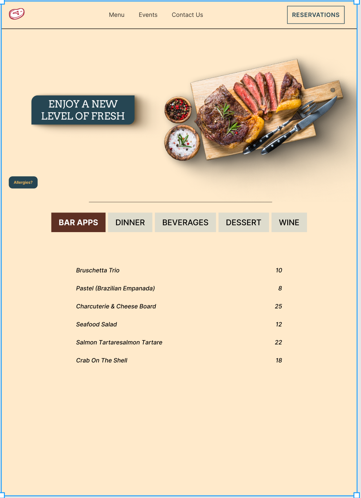

# Home

Hi! Welcome to my page.

I’m Gabe, a freelance digital designer from New Jersey, currently studying at Drexel University in Philadelphia.

With a strong background in the Adobe Suite along with Figma, I bring an interesting creative approach to my work. I am also beginning to focus on the backend side of User Experience and Interaction Design, sharpening my coding skills in VSCode.

With a never back down attitude I’m ready for any challenge thrown my way. A strong work ethic and discipline keeps me on track, delivering for clients on time and with attention to detail.

## **Portfolio**

#### _Photography_

--

1. This photo was apart of a photography assignment where we analyzed leading lines and depth.
2. The photo emphasizes how the building and the sky almost seem to clash, this was done by adjusting the aperture on my camera.
3. The photo has some elements of symmetry in it, my focus was on catching good reflections in the mirror which reveals more than is in frame.
4. ## The photo uses close and far objects in different scales but from the right point of view makes them look similar in size. The contrast between the light building in the back and the black staircase in front was the goal.

#### **Case Studies**

--

1.  This project was for my Design class in which we had to pick one website homepage to recreate. I chose a steakhouse chain called Chimas. I originally thought there was too much clutter and too many options on the home page, so in my redesign I decided to create hover menus to clear space for a better experience.
2.  This assignment uses a frame from the game Elden Ring, from here I separated and groups similar warm and cool colors. After doing that I created a color chart and readjusted the values till I was happy with the result, mixing cool and warm colors throughout.
3.  This project was for a later Design class in which we recreated any app on our phone. I loved the clock app on my phone but always thought it was missing the option to create groupings of alarms, something that might be important for people who have to set several alarms for different reasons. Creating groups was the main focus of the project which I accomplished successfully.
